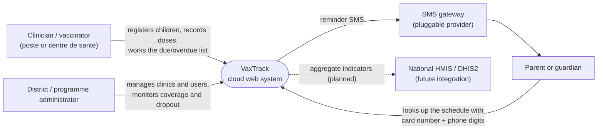
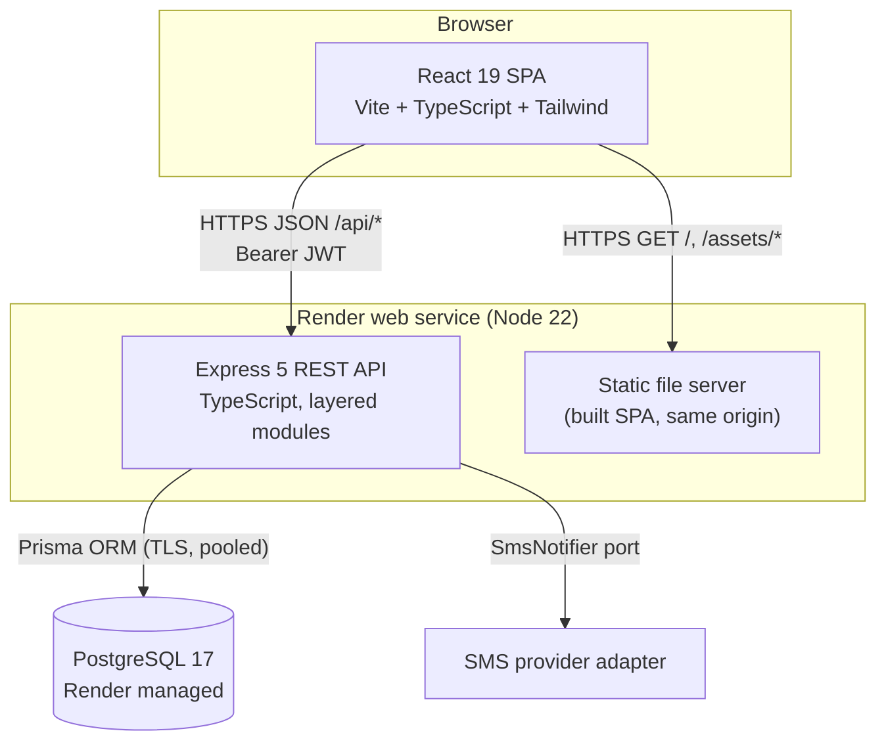
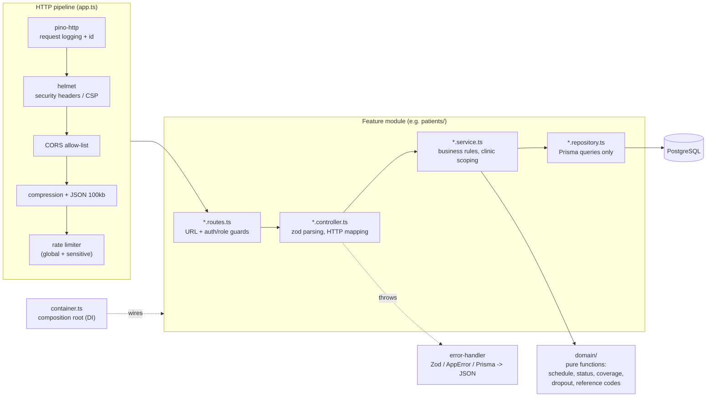
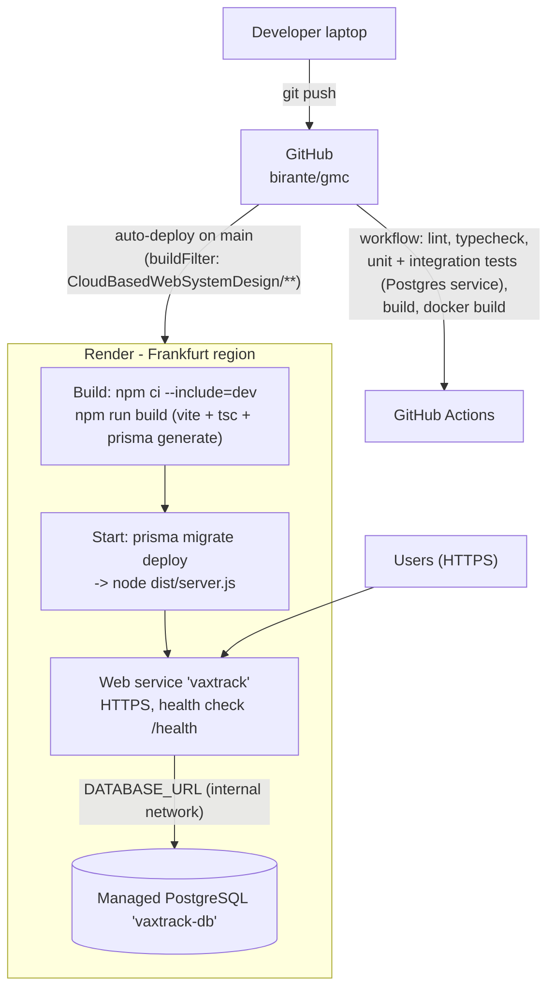
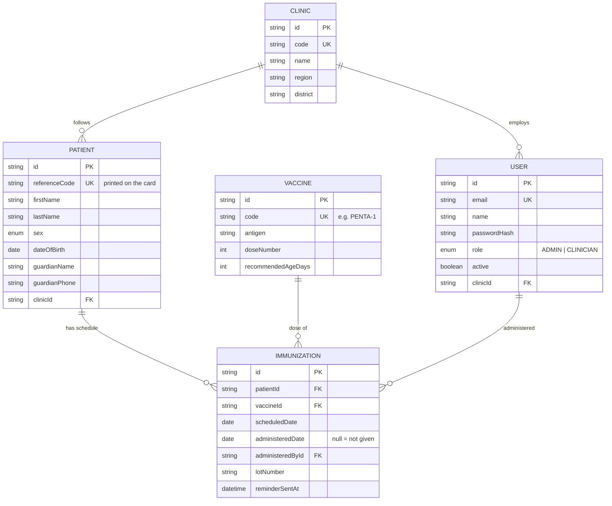
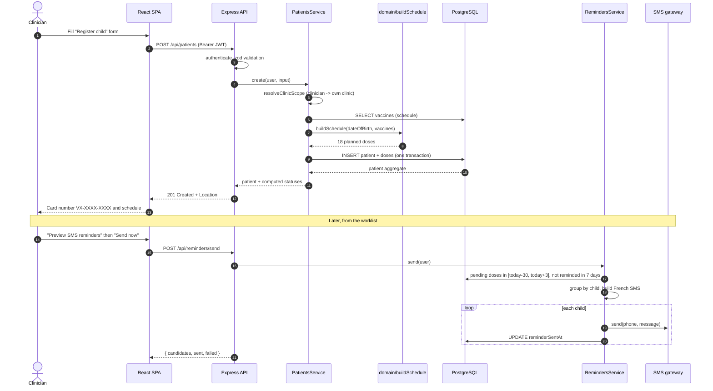

# VaxTrack - Architecture

This document describes the architecture of VaxTrack with [Mermaid](https://mermaid.js.org/) diagrams (GitHub renders them natively). It follows the C4 approach: system context, then containers and components, then deployment, data and a key runtime flow.

## 1. System context

## 2. Containers

A single service serves both the API and the compiled SPA. This removes CORS from the production path, needs one free Render instance, and gives one public URL. The SPA can also be hosted separately (Vercel) by setting `VITE_API_URL`; see DEPLOYMENT.md.

## 3. API components (layered, feature-modular)

Modules: `auth`, `users`, `clinics`, `vaccines`, `patients`, `immunizations`, `dashboard`, `reminders`, `public`, `health`.

Rules enforced by the structure:

- Routes never touch the database; repositories never contain business rules.
- Business rules that do not need I/O (dose status, schedule generation, coverage, dropout) live in `src/domain` and are unit-tested in isolation.
- Services receive repositories through their constructor, so unit tests inject fakes and integration tests use the real Prisma client.
- Every clinic-owned query goes through `resolveClinicScope` / `assertClinicAccess` (multi-tenant isolation in one place).

## 4. Deployment (Render)

The same container image (`Dockerfile`) runs on Azure Container Apps, Google Cloud Run or AWS App Runner with only the environment variables changing.

## 5. Data model

Design decisions:

- **Schedule as data.** The EPI schedule is stored in `Vaccine` rows, not hard-coded, so the programme can change it (for example when a new vaccine is introduced) without a release. Patients registered before a change are healed automatically the next time their record is opened.
- **Status is derived, never stored.** `OVERDUE / DUE / UPCOMING / ADMINISTERED` is calculated from `scheduledDate`, `administeredDate` and today's date. There is no nightly job that could fail and leave statuses stale.
- **One row per planned dose** (`@@unique([patientId, vaccineId])`) makes "record a dose" an idempotent update and makes coverage a cheap `GROUP BY vaccineId`.
- **Indexes** on `(clinicId, lastName)` for search and `(scheduledDate, administeredDate)` for worklists, reminders and dashboards.

## 6. Key flow - registering a child and sending reminders

## 7. Cross-cutting concerns

| Concern | Implementation |
|---|---|
| Authentication | JWT (HS256, 8 h, issuer check), bcrypt password hashes (cost 10), constant-time path for unknown emails |
| Authorisation | Role guard (`ADMIN`, `CLINICIAN`) + clinic scoping in services |
| Validation | zod schemas on every body/query; 400 with field-level details |
| Security headers | helmet (CSP, HSTS, nosniff, frameguard), `x-powered-by` disabled |
| Abuse protection | Global rate limit 300 req / 15 min / IP; 20 req / 15 min on login and public lookup |
| Privacy | Public lookup needs card + phone digits, returns first name + initial only; logs redact auth headers and passwords |
| Observability | pino JSON logs with request ids, `/health` probe with DB check and commit SHA |
| Configuration | 12-factor: everything from environment variables, validated at boot (fail fast) |
| API contract | OpenAPI 3.1 at `/api/openapi.json`, Swagger UI at `/api/docs` |
