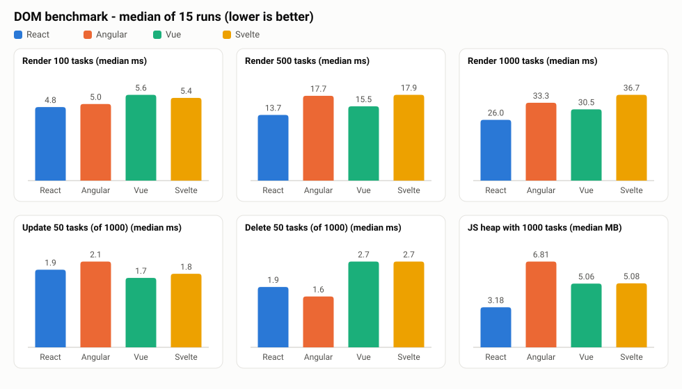

# DOM benchmark: React vs Angular vs Vue vs Svelte

The same to-do list app built four times (React, Angular, Vue, Svelte), plus a Puppeteer
harness that measures how long each framework takes to render, update and delete tasks,
and how much JS heap it uses. The assignment is in [`Readme.md`](Readme.md).

- Reflection report (200-300 words): [`REFLECTION.md`](REFLECTION.md)
- Submission summary: [`SUBMISSION.md`](SUBMISSION.md)
- Raw results: [`benchmark/results/results.json`](benchmark/results/results.json), tables in
  [`benchmark/results/results.md`](benchmark/results/results.md), charts in
  [`benchmark/results/chart.html`](benchmark/results/chart.html) (interactive, Chart.js from CDN) and
  [`benchmark/results/chart.svg`](benchmark/results/chart.svg) (static)



## Project structure

```
.
├── react/      React 19 + Vite      (useState, keys, React.memo rows, useCallback)
├── angular/    Angular 21 (CLI)     (standalone components, @for/track, @if, [(ngModel)], signals, OnPush, zoneless)
├── vue/        Vue 3 + Vite         (<script setup>, ref() deep reactivity, v-for :key, v-if, v-model)
├── svelte/     Svelte 5 + Vite      (runes: $state/$props, {#each} keyed, {#if}, bind:value)
└── benchmark/  Puppeteer harness    (run.mjs, report.mjs, results/)
```

Every app has the same features:

- **Add** a task (name + priority low / medium / high)
- **View** all tasks with a coloured priority badge and a task counter
- **Edit** a task (name and priority, Save / Cancel)
- **Remove** a task
- **Benchmark buttons**: `Render 100`, `Render 500`, `Render 1000` (replace the list with N generated
  tasks), `Update 50` (append ` !!!` to the first 50 names and rotate their priority), `Delete 50`
  (remove the first 50 tasks), `Clear`

The UI and DOM are identical across the four apps: same stylesheet (a copy of the same `styles.css`
in each app), same task generator (`tasks.js` / `tasks.ts`), same element ids and `data-testid`s
(`#task-name`, `#task-priority`, `#add-task`, `#run-100`, `#run-500`, `#run-1000`, `#update-50`,
`#delete-50`, `#clear`, `#task-count`, `#task-list > li.task[data-testid=task][data-id]`, ...).
The harness checks this: it compares an element signature of a rendered row in every app
and the run fails the smoke test if a feature does not work.

Framework-specific choices (each app uses the idiomatic way of updating the DOM):

| | State | List rendering | Row update strategy |
|---|---|---|---|
| React | `useState` (immutable arrays) | `tasks.map(t => <TaskItem key={t.id} />)` | `React.memo` row + stable `useCallback` handlers, so only rows whose object changed re-render |
| Angular | `signal<Task[]>` + `[(ngModel)]` for form fields | `@for (task of tasks(); track task.id)` (built-in successor of `*ngFor` + `trackBy`), `@if` (successor of `*ngIf`) | `OnPush` row component; immutable updates give the 50 changed rows a new reference. Zoneless change detection (Angular 21 default) |
| Vue | `ref([])` (deep reactive proxy) | `v-for="task in tasks" :key="task.id"`, `v-if`, `v-model` | In-place mutation; the reactivity system re-renders only the row components that read the changed fields |
| Svelte | `$state([])` (deep reactive proxy) | `{#each tasks as task (task.id)}`, `{#if}`, `bind:value` | In-place mutation; compiled code updates exactly the changed text nodes / attributes (no virtual DOM) |

## Requirements

- Node 22 (tested with v22.20.0) and npm 10
- The benchmark downloads Chrome for Testing through Puppeteer (`npx puppeteer browsers install chrome`)

Note on Angular: the newest Angular CLI (22.x) requires Node >= 22.22.3, so the project was
generated with the current LTS line, **Angular CLI 21** (`npx @angular/cli@21 new angular`), which
supports Node 22.12+. The generated unit-test setup (Vitest + jsdom) was removed because its
`npm install` failed with an npm 10 peer-resolution bug and tests are not part of this assignment.

## Running the apps

```bash
# React
cd react && npm install && npm run dev          # http://localhost:5173
# Vue
cd vue && npm install && npm run dev            # http://localhost:5173
# Svelte
cd svelte && npm install && npm run dev         # http://localhost:5173
# Angular
cd angular && npm install && npm start          # http://localhost:4200
```

Production builds: `npm run build` in each folder (output in `dist/`, Angular in
`angular/dist/angular/browser`). Build output and `node_modules` are git-ignored (root `.gitignore`
plus `angular/.gitignore` for `.angular/` cache).

## Running the benchmark

```bash
cd benchmark
npm install
npx puppeteer browsers install chrome   # once, if Chrome for Testing is not cached yet
npm run bench                           # = node run.mjs (builds all four apps, then benchmarks)
```

Options: `--skip-build`, `--iterations 15`, `--warmup 5`, `--memory-runs 5`,
`--frameworks react,vue`, `--headful`, `--chrome /path/to/chrome`. `npm run bench:quick` does a short
run. `node report.mjs` regenerates the Markdown/chart files from `results/results.json`.

## Methodology

`benchmark/run.mjs`:

1. Runs `npm run build` (production mode) for every app.
2. Serves each `dist/` folder from a small built-in Node static server (one port per app).
3. Launches headless **Chrome for Testing 154** pinned by Puppeteer 25 (viewport 1280×900).
4. **Smoke test** per app: adds a task, edits its name and priority, removes it, presses every
   benchmark button and checks row counts, labels and that no page error occurred. It also compares
   the element structure of a row across the four apps (result: identical).
5. **Timing.** For every framework and operation a fresh page is opened, then
   5 warm-up + 15 measured iterations. Each iteration:
   - brings the page into the start state (not timed): `Clear` for the render tests,
     `Clear` + `Render 1000` for Update 50 / Delete 50 (so they run on a 1000-row list),
   - forces two garbage collections (CDP `HeapProfiler.collectGarbage`) and waits two frames, so a GC
     pause from the previous iteration does not land in the timed window,
   - runs inside the page:
     `t0 = performance.now(); button.click(); await setTimeout(0); document.body.offsetHeight; t1 = performance.now()`.
     React 19, Vue 3 and Svelte 5 flush in a microtask and zoneless Angular schedules change detection
     with `setTimeout(0)` racing `requestAnimationFrame`, so after the timer all four have patched the DOM;
     reading `offsetHeight` forces the browser's style recalculation and layout.
     **Primary metric = t1 - t0 = script + DOM patch + style + layout** (paint is not included).
   - verifies at `t1` that the DOM has the expected number of rows (and the updated text for
     Update 50), so an asynchronous render cannot escape the timed window,
   - also records **click -> next rendered frame** (`requestAnimationFrame` + `setTimeout(0)`).
     This one includes waiting for the next vsync, so it is quantised to ~16.7 ms frames; it is reported
     as a secondary table only.
6. Median, mean, standard deviation, min and max are computed per operation.
7. **Memory**: 5 fresh page loads per app; JS heap (`JSHeapUsedSize` from CDP `Performance.getMetrics`,
   after forced GC) is read when the app is loaded, with 1000 tasks, after Update 50 + Delete 50, and
   after Clear. The DOM node count (`Nodes`) with 1000 tasks is recorded as well.
8. Writes `results/results.json`, `results/results.md`, `results/chart.html`, `results/chart.svg`.

A first attempt measured only "click -> next frame"; every operation then took 18-20 ms in all four
frameworks because the number was dominated by waiting for the next frame, which is why the primary
metric stops at layout.

## Results

Machine: **Apple M1 Pro (8 cores), 16 GB RAM, macOS 27.0.1 (Darwin 27.0.0, arm64)**,
Chrome for Testing 154.0.8037.57 headless, Node v22.20.0. Run date: 2026-10-01.
15 measured iterations after 5 warm-up iterations; memory over 5 page loads.

### Time per operation, median in ms (click -> DOM patched -> style + layout; lower is better)

| Operation | React 19.3 | Angular 21.2 | Vue 3.5 | Svelte 5.57 |
|---|---:|---:|---:|---:|
| Render 100 tasks | **4.80** | 5.00 | 5.60 | 5.40 |
| Render 500 tasks | **13.70** | 17.70 | 15.50 | 17.90 |
| Render 1000 tasks | **26.00** | 33.30 | 30.50 | 36.70 |
| Update 50 tasks (of 1000) | 1.90 | 2.10 | **1.70** | 1.80 |
| Delete 50 tasks (of 1000) | 1.90 | **1.60** | 2.70 | 2.70 |

Mean ± standard deviation (ms):

| Operation | React | Angular | Vue | Svelte |
|---|---:|---:|---:|---:|
| Render 100 tasks | 4.57 ± 0.68 | 5.07 ± 0.41 | 5.54 ± 0.42 | 5.39 ± 0.21 |
| Render 500 tasks | 13.83 ± 0.51 | 17.86 ± 0.56 | 15.55 ± 0.52 | 17.83 ± 0.70 |
| Render 1000 tasks | 26.19 ± 0.67 | 33.37 ± 0.57 | 30.35 ± 0.66 | 36.63 ± 0.61 |
| Update 50 tasks | 1.97 ± 0.18 | 2.12 ± 0.13 | 1.65 ± 0.20 | 1.79 ± 0.21 |
| Delete 50 tasks | 1.97 ± 0.22 | 1.57 ± 0.09 | 2.72 ± 0.08 | 2.77 ± 0.33 |

The update/delete differences are a few tenths of a millisecond (close to the 0.1 ms resolution of
`performance.now()` in the page) and the standard deviations overlap partly, so they are small effects.
The render differences (up to ~10 ms for 1000 tasks) are well outside the noise.

Click -> next rendered frame, median in ms (secondary, frame-quantised):

| Operation | React | Angular | Vue | Svelte |
|---|---:|---:|---:|---:|
| Render 100 tasks | 17.70 | 17.60 | 18.20 | 17.90 |
| Render 500 tasks | 18.60 | 19.90 | 18.60 | 20.10 |
| Render 1000 tasks | 29.70 | 37.00 | 34.00 | 40.00 |
| Update 50 tasks | 18.00 | 18.10 | 18.50 | 18.00 |
| Delete 50 tasks | 19.90 | 20.30 | 20.10 | 19.90 |

### Memory (JS heap used after forced GC, median MB; lower is better)

| State | React | Angular | Vue | Svelte |
|---|---:|---:|---:|---:|
| App loaded (0 tasks) | 1.30 | 1.82 | 1.08 | **0.99** |
| 1000 tasks rendered | **3.18** | 6.81 | 5.06 | 5.08 |
| Delta for 1000 tasks | **1.88** | 4.99 | 3.98 | 4.09 |
| After Update 50 + Delete 50 | **3.39** | 6.59 | 4.93 | 4.95 |
| After Clear | 2.01 | 2.46 | 1.63 | **1.37** |
| DOM nodes with 1000 tasks | 9079 | 11085 | 9083 | 11166 |

The 5000 elements are the same in every app. Angular and Svelte additionally keep comment nodes as
anchors for `@for`/`@if` and `{#each}`/`{#if}` blocks (Angular 2001, Svelte 1000 inside the list),
which explains their higher node counts.

### Bundle size (production JS)

| Framework | JS raw (KB) | JS gzip (KB) |
|---|---:|---:|
| React | 218.4 | 67.3 |
| Angular | 164.8 | 51.5 |
| Vue | 67.8 | 26.1 |
| Svelte | 42.3 | 16.2 |

### Optimisation experiment (Svelte, not part of the table above)

Svelte's deep `$state` proxies every task object. As an experiment the Svelte app was switched
to `$state.raw` with immutable updates (like the React/Angular versions) and benchmarked once with
the same settings (15 iterations, 5 warm-up). Medians: Render 100 = 4.8 ms, Render 500 = 15.1 ms,
Render 1000 = 30.8 ms (vs 36.7), Update 50 = 2.0 ms (vs 1.8), Delete 50 = 1.3 ms (vs 2.7),
heap with 1000 tasks 4.01 MB (vs 5.08). The committed app keeps the idiomatic deep `$state`
version so that all four apps follow their framework's default style; the experiment shows that the
render cost difference is mostly the cost of creating reactive proxies, not of the compiled DOM code.

### Caveats

- One machine, one browser, headless mode, no CPU throttling. Absolute numbers will differ on other
  hardware; relative order is what matters.
- The timed window stops after layout; paint/composite are not included in the primary metric.
- Small apps: the results show framework overhead for simple list operations, not for real-world apps.
