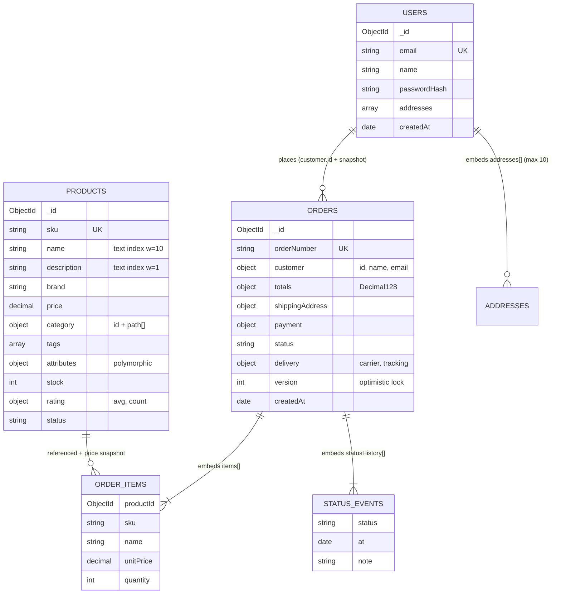
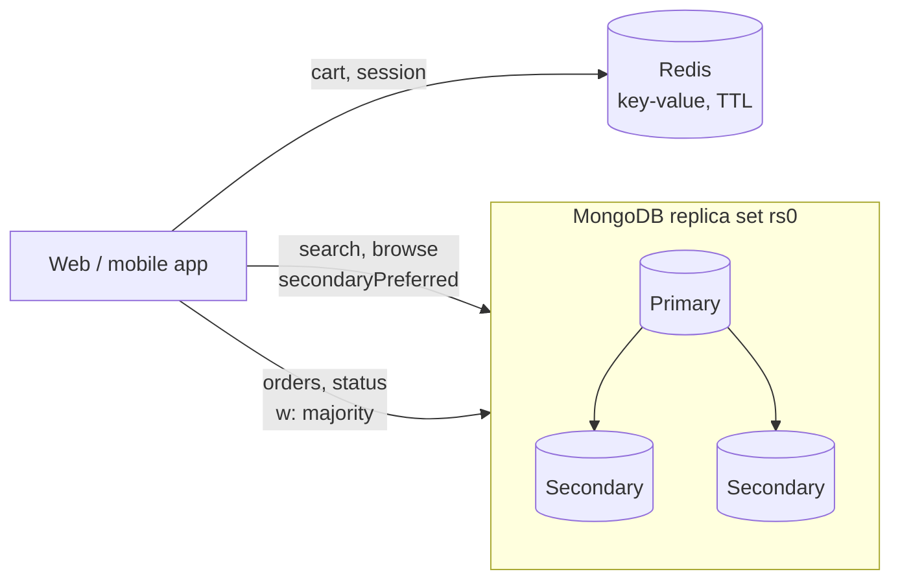

# Part 1: Initial NoSQL Design for an E-commerce Application

## 1. Requirements

| # | Requirement | What it means for the data layer |
|---|-------------|----------------------------------|
| R1 | Users browse and search products | Fast lookups by category, sorting by price/rating, **full-text search** |
| R2 | Orders hold customer info, items and delivery status | One order must be readable in **one round trip**; status changes must be **consistent** |
| R3 | Thousands of transactions per second | Writes must be cheap (one document, few indexes); the design must be able to **scale out** later |

## 2. Choice of NoSQL model

| Model | Fit for this app | Decision |
|-------|------------------|----------|
| **Document (MongoDB)** | Products have different attributes per category (RAM for laptops, size for shoes). An order is a natural aggregate: header, lines, address, history. Has secondary indexes, a text index, ACID transactions and sharding. | **Primary store** |
| Key-value (Redis) | Sub-millisecond reads/writes on a key with a TTL. Not queryable by attributes. | **Shopping carts, sessions, rate limiting, hot product cache.** A cart is `cart:{userId}` → hash `{sku: qty}` with a 7-day TTL. It is rewritten on every click and does not need to be durable, so keeping it out of MongoDB saves a lot of write load. |
| Wide-column (Cassandra) | Very good for write-heavy time series. Weak for ad-hoc queries and multi-document transactions (stock + order). | Not needed for Part 1 |
| Graph (Neo4j) | Recommendations ("customers who bought X also bought Y"). | Possible later add-on, not the system of record |

MongoDB is the system of record. Redis sits beside it as a cache and holds ephemeral state.

## 3. Key entities

| Entity | Collection | Notes |
|--------|------------|-------|
| User / customer | `users` | Addresses are **embedded**: there are at most 10 and they are always read with the user |
| Product | `products` | Flexible `attributes` sub-document; category stored as an id plus a materialised `path` array |
| Order | `orders` | Self-contained **snapshot** of the customer, item lines (name and price at purchase time), shipping address, payment and delivery |
| Order line | embedded in `orders.items` | Bounded (`maxItems: 200`) and never queried without its order |
| Status event | embedded in `orders.statusHistory` | Grows by about 4 to 6 entries per order, so it stays bounded |
| Cart / session | **Redis** | Ephemeral, high churn |

## 4. Access patterns → schema decisions

| ID | Access pattern | Frequency | Query | Index | Schema decision |
|----|----------------|-----------|-------|-------|-----------------|
| AP1 | Full-text search with price filter | Very high (read) | `$text` + `status` + `price` sorted by `textScore` | `product_text` (weighted: name 10, brand 5, tags 5, description 1) | Searchable fields live on the product document |
| AP2 | Browse a category, sorted by price / rating, paginated | Very high (read) | `category.path` = X, `status` = active, sort `price` | `{category.path, status, price}` and `{category.path, status, rating.avg}` (ESR rule) | `category.path` is an array, so one multikey index serves both "electronics" and "electronics/phones". **Keyset pagination** instead of `skip` |
| AP3 | Product detail page | Very high (read) | `findOne({sku})` | unique `sku` | Everything for the page is in one document (rating summary embedded, reviews would be a separate collection) |
| AP4 | Place an order | High (write) | Conditional `$inc` on stock + `insertOne` order in a **transaction** | `_id`, unique `orderNumber` | Item names and prices are **copied** into the order so later catalog edits never change past orders |
| AP5 | "My orders" | Medium (read) | `customer.id` = X sort `createdAt` desc | `{customer.id, createdAt:-1}` | Customer reference + snapshot embedded in the order: no join needed |
| AP6 | Update / track delivery status | High (write + read) | `updateOne({orderNumber, version}, {$set status, $push statusHistory, $inc version})` | unique `orderNumber` | Status and history live in **one document**, so a single atomic update changes both |
| AP7 | Fulfilment queue (oldest paid orders) | Medium (back office) | `status` = paid sort `createdAt` | `{status, createdAt}` | Low-cardinality `status` is fine as the first key because it is always an equality match |

Every index has to justify itself: each extra index adds a write to every order insert. `orders` has only four indexes.

## 5. Embedding vs referencing

| Relationship | Choice | Why |
|--------------|--------|-----|
| User → addresses | **Embed** | 1-to-few, always read together |
| Order → items, address, status history | **Embed** | The order is the unit of consistency. One document means one atomic write and one read |
| Order → customer | **Reference + snapshot** (`customer.id`, `name`, `email`) | The id is for "my orders". The snapshot keeps what the order looked like at purchase time |
| Order item → product | **Reference + snapshot** (`productId`, `sku`, `name`, `unitPrice`) | Prices change, but an invoice must not |
| Product → reviews | **Reference** (separate collection, not implemented) | Unbounded 1-to-many. Embedding would grow the product document without limit. Only `rating.avg/count` is embedded |
| Product → category | Embedded id + path | Categories rarely change. The path array avoids recursive lookups |

## 6. Consistency and durability

| Operation | Mechanism | Write / read concern | Reason |
|-----------|-----------|----------------------|--------|
| Place order (stock + order) | Multi-document **transaction**. The stock decrement is conditional (`stock >= qty`), so overselling is impossible | `w: "majority"`, `readConcern: "snapshot"` | An acknowledged order must survive a primary failover |
| Status update | Single-document atomic update + **optimistic lock** (`version`) | `w: "majority"` | Two workers can never apply conflicting transitions. The stale update is rejected (shown in `queries.js`) |
| Track my order | Read from **primary** | `readConcern: "majority"` | A customer should never see a status go backwards |
| Browse / search catalog | Can read from secondaries | `readPreference: "secondaryPreferred"`, `readConcern: "local"` | A product page a few hundred ms stale is acceptable and frees the primary for writes |
| Carts (Redis) | No durability guarantee | n/a | Losing a cart is an inconvenience, not a business error |

Money uses `Decimal128` (`NumberDecimal`), never binary floating point.

## 7. Scalability for thousands of TPS

* **One write per order.** All parts of the order are embedded, so the hot path is one insert plus one `$inc` per line, and both use indexes.
* **Few indexes on write-heavy collections.** `orders` has 4.
* **Reads offloaded.** Catalog reads go to secondaries and a Redis cache. Search can move to Atlas Search / OpenSearch if relevance tuning is needed.
* **Ready for sharding.** Every order carries `customer.id`, a natural high-cardinality shard key, which Part 2 uses.
* The deployment is already a **replica set** (`rs0`), which transactions require.

## 8. Diagram

## 9. Files

* `schema.js`: collections with `$jsonSchema` validators and all indexes
* `seed.js`: deterministic sample data (20 users, 42 products, 300 orders over 30 days)
* `queries.js`: AP1 to AP7, including the order transaction, its rollback path, optimistic locking, and `explain()` output that shows which index each query uses
