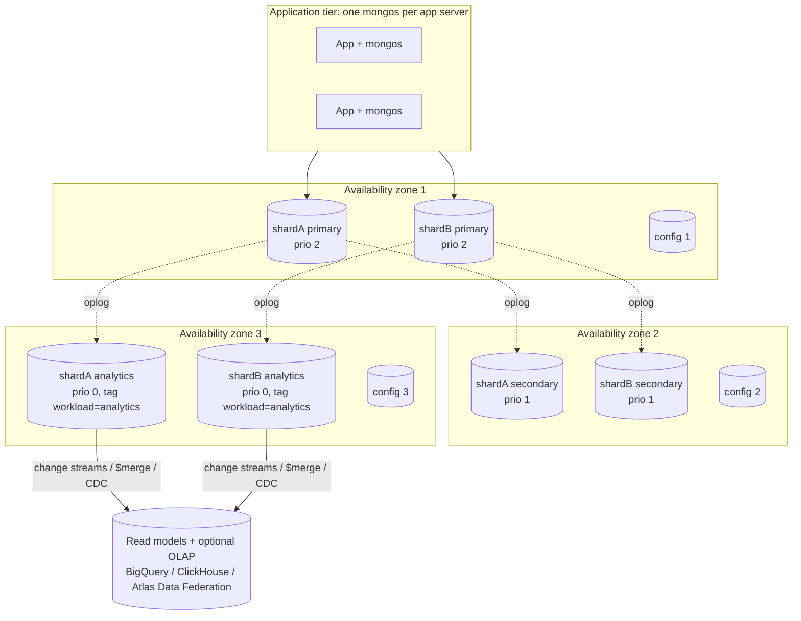

# Part 2: Refactored Design for Analytics and High Availability

## 1. New requirements

| Requirement | Consequence |
|-------------|-------------|
| **Large-scale analytics** on product trends and sales | Dashboards must not scan millions of raw orders on the primaries that serve checkout. We need **pre-aggregated, denormalised read models** and a way to run ad-hoc analysis in isolation |
| **High availability and partition tolerance** as users grow | No single node may be a point of failure. Data and traffic must be spread over **shards**, each a **replica set spanning availability zones** |

The strategy combines all three suggested techniques: **sharding + replication + denormalisation / pre-aggregation**.

## 2. What changed and why

| Area | Part 1 | Part 2 | Why |
|------|--------|--------|-----|
| Topology | 1 replica set | 2+ shards × 3-member replica sets + config RS + `mongos` routers | Horizontal write scaling and fault isolation |
| `orders` customer field | `customer.id` nested | top-level `customerId` (**hashed shard key**) | A clean, immutable shard key. Targeted queries for "my orders" |
| `orders` analytics fields | none | `orderDay`, `country`, `items[].categoryId`, `items[].brand`, `items[].lineTotal` | **Denormalisation**: analytics pipelines never need `$lookup` to group by day / category / country |
| `orderNumber` uniqueness | global unique index | unique `{customerId, orderNumber}` + non-unique `orderNumber` index | On a sharded collection a unique index must start with the shard key. Order numbers are generated globally unique by the app (time + random part); the index only guarantees idempotency per customer |
| Stock | `products.stock` | new **`inventory`** collection (`_id` = productId, hashed) + `products.inStock` flag | Stock is the hottest counter in the system. Moving it out keeps catalog documents almost read-only (cache-friendly, no write contention with browsing) and lets inventory shard independently |
| `products` | unsharded | sharded on `{category.id: 1, sku: 1}` (range) | Category browsing, the main catalog query, targets one shard. The shard key is unique, so SKU uniqueness is still enforced |
| Analytics | queries on raw `orders` | **`daily_sales`, `product_daily_sales`, `product_stats`** maintained by idempotent `$merge` pipelines, triggered by a **change stream** | Dashboards read 30 tiny documents instead of aggregating millions of orders |
| Ad-hoc analysis | n/a | routed to **analytics secondaries** (priority 0, tag `workload: analytics`) or offloaded to an OLAP store | Heavy scans never compete with checkout |
| Default concerns | per operation | cluster-wide default `w: "majority"`, `readConcern: "majority"`, relaxed explicitly where acceptable | Safe by default |

## 3. Sharding

| Collection | Shard key | Type | Justification | Queries |
|------------|-----------|------|---------------|---------|
| `orders` | `{ customerId: "hashed" }` | Hashed | Millions of customers give very high cardinality. Hashing spreads **inserts evenly** across all shards (an `_id`/`createdAt` key would send every insert to the last chunk, a "hot shard"). `customerId` is immutable and present in every customer-facing query | "My orders", order tracking and status updates by the customer go to **one shard**. Back-office `status` queue and `orderNumber` lookup are scatter-gather, which is acceptable for low-volume staff traffic |
| `inventory` | `{ _id: "hashed" }` | Hashed | Accessed only by productId. Hashing spreads best-sellers | Stock check / decrement go to one shard |
| `products` | `{ "category.id": 1, sku: 1 }` | Ranged | Browsing by category is the dominant query, so ranges keep a category together. `sku` adds cardinality so large categories still split into many chunks. Also serves as the unique constraint | Browse a category goes to one shard (verified with `explain()`). Full-text search is scatter-gather, merged by `mongos` |
| `users`, `daily_sales`, `product_*`, `etl_state` | unsharded | n/a | Small. They live on the database's primary shard, which is itself a 3-node replica set, so they are still highly available | n/a |

Things that were considered and rejected:

* `orders` on `{createdAt: 1}`: monotonic, so every insert lands on one shard. That would kill the "thousands of TPS" requirement.
* `orders` on `{status: 1}`: only 6 values, so the chunks would become huge and impossible to split ("jumbo").
* `products` on `{_id: "hashed"}`: even distribution, but every category page would become scatter-gather.
* **Zone sharding** (`sh.addShardToZone` + `sh.updateZoneKeyRange`) on a `{country, customerId}` key would pin African and European customers' orders to shards in their region for latency or data residency. It is a natural next step once the business runs in several regions.

Note: with only 20 demo customers, the hashed distribution is uneven (about 74% / 26%). With realistic cardinality (millions of customers) hashing gives a near-uniform split.

## 4. Replication and replica set topology

* **Every shard is a 3-member replica set across 3 AZs.** The loss of one zone leaves a majority (2/3), so a new primary is elected automatically, typically in under 12 seconds. Writes with `w: majority` keep being accepted.
* The **3rd member is an analytics node**: priority 0 (never becomes primary), but it still votes and acknowledges majority writes. Tag `{workload: "analytics"}` lets reporting jobs target it with `readPreference: secondary` + tag set, isolating heavy scans from OLTP. Larger deployments add a 4th/5th non-voting analytics member instead.
* **Config servers** are a 3-member replica set (1 in the demo).
* **`mongos`** is stateless and runs next to each application server, so there is no single router to lose.
* Drivers use `retryWrites=true&retryReads=true`, so a failover is transparent to most requests.

## 5. Read and write concerns per use case (CAP trade-offs)

MongoDB is **CP for a single document/shard** (a minority partition cannot accept writes). Using read preferences and concerns we choose, per use case, where to sit between consistency and availability:

| Use case | Write concern | Read concern / preference | CAP position | Why |
|----------|---------------|---------------------------|--------------|-----|
| Place order (inventory + order, distributed transaction) | `majority` | `snapshot`, primary | **C** over A | Money and stock: never oversell, never lose an acknowledged order. During a partition the minority side rejects the order rather than accepting a conflicting one |
| Update delivery status | `majority` + optimistic `version` | primary, `majority` | C | Status must never go backwards |
| Track my order | n/a | `primaryPreferred`, `majority` | C, but still readable if the primary is down | Customers see a committed status even during an election |
| Browse / search catalog | n/a | `secondaryPreferred` + `maxStalenessSeconds: 90`, `local` | **A** over C | A price a few seconds old is acceptable. Reads keep working even if the primary is unreachable. Price is re-checked at checkout |
| Product stock badge | n/a | `products.inStock` (async flag) / Redis | A | Real stock is checked in the transaction |
| Carts, sessions | Redis (replicated, AOF every second) | Redis | A | Losing a few seconds of cart changes is tolerable |
| Dashboards (read models) | `$merge` writes with `majority` | `secondaryPreferred`, `local` | A | Numbers are minutes old by design |
| Ad-hoc analytics | n/a | `secondary` + tag `workload: analytics`, `local` | A | Isolation is worth more than freshness |
| Click / view events (future) | `w: 1` | n/a | A, fast | High volume. Losing a handful of events during a failover is acceptable |

**PACELC view:** even without a partition we trade latency for consistency per use case. Order writes pay the `majority` round-trip; catalog reads take the cheap local read.

**Distributed transactions:** inventory and orders now have different shard keys, so placing an order may touch 2 shards, which means a two-phase commit coordinated by `mongos`. It is correct but slower. At very high scale the alternative is a **reservation pattern**: a single-document `$inc` on `inventory` to reserve, insert the order, and release on timeout. That trades atomicity for eventual consistency handled by the application.

## 6. Denormalisation and pre-aggregation

### Read models

| Collection | Grain | Content | Serves |
|------------|-------|---------|--------|
| `daily_sales` | 1 doc / day (`_id: "2026-09-30"`) | orders, cancelled, revenue, AOV, items sold, `byCategory[]`, `byCountry[]`, `byPaymentMethod[]` | Revenue trend, category share, country and payment-method mix |
| `product_daily_sales` | 1 doc / product / day (`_id: {productId, day}`) | units, revenue, orders, categoryId | Product trends, week-over-week growth |
| `product_stats` | 1 doc / product | all-time and rolling-30-day units and revenue, last sold day, name, brand | "Top products", "trending in category" (indexed on `last30d.revenue`) |
| `etl_state` | 1 doc / job | watermark, last run | Incremental processing |

A year of dashboards reads **365 small documents** instead of aggregating every order line of the year.

### How they are maintained (`aggregations.js`)

1. **Change stream** on `orders` (`insert`/`update`, `fullDocument: updateLookup`), opened through `mongos`, so it covers all shards in order. A small worker consumes it and stores the **resume token**, so it continues exactly where it stopped after a crash.
2. In micro-batches (for example every minute), the worker calls `refreshSalesReadModels()`:
   * finds the `orderDay`s touched since the **watermark** (`updatedAt >= watermark`, indexed),
   * **recomputes those whole days** from `orders` and upserts them with **`$merge`** (`whenMatched: "replace"` for the headline document, `"merge"` for each breakdown field),
   * recomputes `product_daily_sales` for those days, and `product_stats` for the products touched (with a `$lookup` into the sharded `products` collection).
3. **Idempotent by construction.** Each run recomputes whole buckets instead of incrementing counters. Re-runs, overlapping windows (the watermark keeps a 5 s overlap) and late status changes such as cancellations or returns never double-count. The demo cancels an order and shows `daily_sales` for that day going from 4 to 3 orders.
4. A **nightly job** recomputes `product_stats` for every product, because the 30-day window slides even when no new order arrives. It reads only `product_daily_sales`, which is cheap.

### OLAP offload (optional, at larger scale)

When analysts need arbitrary SQL over years of history, the raw orders are streamed from the change stream (or Kafka Connect / Debezium on the oplog) into a columnar warehouse (BigQuery, ClickHouse, Snowflake) or queried in place with Atlas Data Federation / Online Archive. MongoDB stays the operational store. The in-cluster read models keep powering low-latency in-app dashboards.

## 7. Trade-offs accepted

| Gain | Cost |
|------|------|
| Linear write scaling for orders | Scatter-gather for back-office queries that do not include `customerId` |
| Fast dashboards (milliseconds) | Read models are **eventually consistent** (about 1 minute behind); extra storage; ETL code to maintain |
| Catalog documents are cache-friendly | Stock lives in another collection, so placing an order is a distributed transaction (or the reservation pattern) |
| Survives the loss of a whole AZ | 3× storage. `majority` writes add one cross-AZ round trip (~1-2 ms) |
| Denormalised `categoryId`/`brand` in order lines | If a product changes category, historical orders keep the old one. That is correct for "as sold" reporting, but has to be documented for analysts |

## 8. Files

| File | Purpose |
|------|---------|
| `schema.js` | Refactored collections, validators and shard-key-compatible indexes |
| `sharding.js` | `setDefaultRWConcern`, `sh.enableSharding`, `sh.shardCollection`, pre-split and chunk placement, distribution report |
| `migrate.js` | Moves Part 1 data (`shop_v1`) into the new shape (stock split into `inventory`, denormalised order lines) |
| `aggregations.js` | `$merge` read-model pipelines, dashboard queries A1 to A4, ad-hoc query on analytics secondaries (A5), change-stream demo, `explain()` routing proof |
| `docker-compose.yml` + `cluster/init-cluster.sh` | Sharded + replicated cluster in Docker |
| `cluster/start-local.sh` | Same topology with native `mongod`/`mongos` binaries (no Docker needed) |
