```mermaid
gantt
    title FCFS Schedule
    dateFormat  X
    axisFormat  %s

    section CPU
    P1 : 0, 5
    P2 : 5, 8
    P3 : 8, 9
```

```mermaid
gantt
    title Round Robin (quantum = 2) Schedule
    dateFormat  X
    axisFormat  %s

    section CPU
    P1 : 0, 2
    P2 : 2, 4
    P3 : 4, 5
    P1 : 5, 7
    P2 : 7, 8
    P1 : 8, 9
```

# OS Task Manager — Analysis

---

## Part 1 — Process Scheduling

### Given

| Process | Arrival Time (AT) | Burst Time (BT) |
| :-----: | :---------------: | :-------------: |
| P1      | 0                 | 5               |
| P2      | 1                 | 3               |
| P3      | 2                 | 1               |

### 1.1 FCFS (First-Come, First-Served)

Non-preemptive; processes run in arrival order.

**Gantt chart**



Compact view:

```
| ---- P1 ---- | -- P2 -- | P3 |
0              5          8    9
```

**Per-process metrics**

| Process | Arrival | Burst | Start | Completion (CT) | Turnaround (CT − AT) | Waiting (TAT − BT) | Response (Start − AT) |
| :-----: | :-----: | :---: | :---: | :-------------: | :------------------: | :----------------: | :-------------------: |
| P1      | 0       | 5     | 0     | 5               | 5                    | 0                  | 0                     |
| P2      | 1       | 3     | 5     | 8               | 7                    | 4                  | 4                     |
| P3      | 2       | 1     | 8     | 9               | 7                    | 6                  | 6                     |

**Averages**

- Waiting time  = (0 + 4 + 6) / 3 = **3.33**
- Turnaround   = (5 + 7 + 7) / 3 = **6.33**
- Response time = (0 + 4 + 6) / 3 = **3.33**

### 1.2 Round Robin, quantum = 2

Preemptive; each process runs for at most 2 time units, then is placed at the back of the ready queue. **Convention used** at every tick where a preemption and an arrival coincide: **new arrivals are enqueued before the preempted process**.

**Trace of the ready queue**

| Time | Event                                | Ready queue after | Running |
| :--: | ------------------------------------ | ------------------ | :-----: |
| 0    | P1 arrives                           | [ ]                | P1      |
| 1    | P2 arrives                           | [P2]               | P1      |
| 2    | P3 arrives, P1 quantum ends (rem 3)  | [P2, P3, P1]       | P2      |
| 4    | P2 quantum ends (rem 1)              | [P3, P1, P2]       | P3      |
| 5    | P3 finishes                          | [P1, P2]           | P1      |
| 7    | P1 quantum ends (rem 1)              | [P2, P1]           | P2      |
| 8    | P2 finishes                          | [P1]               | P1      |
| 9    | P1 finishes                          | [ ]                | —       |

**Gantt chart**



Compact view:

```
| P1 | P2 | P3 | P1 | P2 | P1 |
0    2    4    5    7    8    9
```

**Per-process metrics**

| Process | Arrival | Burst | First run | Completion (CT) | Turnaround | Waiting | Response |
| :-----: | :-----: | :---: | :-------: | :-------------: | :--------: | :-----: | :------: |
| P1      | 0       | 5     | 0         | 9               | 9          | 4       | 0        |
| P2      | 1       | 3     | 2         | 8               | 7          | 4       | 1        |
| P3      | 2       | 1     | 4         | 5               | 3          | 2       | 2        |

**Averages**

- Waiting time  = (4 + 4 + 2) / 3 = **3.33**
- Turnaround   = (9 + 7 + 3) / 3 = **6.33**
- Response time = (0 + 1 + 2) / 3 = **1.0**

### 1.3 Which one is more responsive?

**Round Robin.** Average waiting and turnaround happen to be identical to FCFS on this workload (3.33 and 6.33), but the **response time** — how quickly each process first gets the CPU — drops from **3.33** under FCFS to **1.0** under Round Robin.

Under FCFS, P3 waits 6 units doing nothing before it can execute a single instruction, even though its burst is only 1. Under RR, P3 sees the CPU after 2 units. That responsiveness is exactly what interactive workloads (typing, GUI clicks, terminal echoes) need: users notice waiting time to *first response*, not total completion.

Trade-off: RR pays context-switch overhead (five switches vs zero here), and long CPU-bound jobs get a slightly worse turnaround. Choosing a quantum is the tuning knob: too small → thrash on switches; too large → RR degenerates into FCFS.

---

## Part 2 — Process Synchronization

### 2.1 What can go wrong without synchronization

`counter++` looks atomic but is not. At the machine level it is at least three steps:

```
LOAD  Rx, counter          ; read
ADD   Rx, Rx, 1            ; modify
STORE counter, Rx          ; write
```

If P1 and P2 interleave in the middle of this sequence, they can both read the same value, both add one, and both write the same new value — so **one increment is lost**. This is a classic **lost-update race condition**.

**Example interleaving** — counter starts at 0:

| Time | P1                        | P2                        | counter |
| :--: | ------------------------- | ------------------------- | :-----: |
| t1   | R1 ← counter (0)          |                           | 0       |
| t2   |                           | R2 ← counter (0)          | 0       |
| t3   | R1 ← R1 + 1               |                           | 0       |
| t4   |                           | R2 ← R2 + 1               | 0       |
| t5   | counter ← R1 (1)          |                           | 1       |
| t6   |                           | counter ← R2 (1)          | 1       |

Two increments happened logically, but the stored value only rose by one. After 200 increments in total (100 each), the final counter could be anywhere between **100 and 200**, non-deterministically.

### 2.2 Suggested mechanism

A **mutex** (mutual-exclusion lock) is the right tool here — the critical section is tiny (a single increment) so a heavyweight monitor is overkill and a counting semaphore is more than we need (there is only one "unit" of the shared resource: the write privilege).

Alternatives and when to prefer them:
- **Binary semaphore** — behaviourally equivalent to a mutex for this problem; slightly more general (semaphores don't necessarily carry an ownership concept).
- **Counting semaphore** — used when *N* concurrent accesses are permitted; not applicable here (N = 1).
- **Monitor** — a language-level construct that ties data and its lock together; nicer at scale but heavier syntactically.

For a two-thread integer increment: **mutex.**

### 2.3 Pseudocode

```pseudo
shared integer counter = 0
mutex M

procedure increment_counter():
    for i from 1 to 100:
        acquire(M)              # blocks if the other process holds M
        counter = counter + 1   # critical section
        release(M)              # wakes any process blocked on acquire(M)

# both processes run the same procedure concurrently
parbegin
    P1: increment_counter()
    P2: increment_counter()
parend

assert counter == 200
```

**Why this works** — `acquire(M)` is guaranteed to admit at most one process at a time. The three-step read/modify/write above happens under the lock, so no other process can observe or overwrite `counter` mid-update. The final value is deterministically **200**.

---

## Part 3 — Memory Management (Page Replacement)

### Given

- Reference string: **1, 2, 3, 2, 4, 1, 5**
- Frames: **3**

### 3.1 FIFO

FIFO evicts the page that entered the frame set **first** (queue order). Hits do not update the queue.

| Step | Ref | Frames after (age order, oldest → newest) | Queue           | Hit / Fault | Evicted |
| :--: | :-: | :---------------------------------------- | :-------------- | :---------: | :-----: |
| 1    | 1   | [ 1 ]                                     | [1]             | **F**       | —       |
| 2    | 2   | [ 1, 2 ]                                  | [1, 2]          | **F**       | —       |
| 3    | 3   | [ 1, 2, 3 ]                               | [1, 2, 3]       | **F**       | —       |
| 4    | 2   | [ 1, 2, 3 ]                               | [1, 2, 3]       | Hit         | —       |
| 5    | 4   | [ 2, 3, 4 ]                               | [2, 3, 4]       | **F**       | 1       |
| 6    | 1   | [ 3, 4, 1 ]                               | [3, 4, 1]       | **F**       | 2       |
| 7    | 5   | [ 4, 1, 5 ]                               | [4, 1, 5]       | **F**       | 3       |

**FIFO page faults: 6**

### 3.2 LRU

LRU evicts the page that was **used the longest time ago**. Hits promote the page to most-recently-used.

| Step | Ref | Frames after | LRU order (LRU → MRU) | Hit / Fault | Evicted |
| :--: | :-: | :----------- | :-------------------- | :---------: | :-----: |
| 1    | 1   | [ 1 ]        | 1                     | **F**       | —       |
| 2    | 2   | [ 1, 2 ]     | 1, 2                  | **F**       | —       |
| 3    | 3   | [ 1, 2, 3 ]  | 1, 2, 3               | **F**       | —       |
| 4    | 2   | [ 1, 2, 3 ]  | 1, 3, 2               | Hit         | —       |
| 5    | 4   | [ 2, 3, 4 ]  | 3, 2, 4               | **F**       | 1       |
| 6    | 1   | [ 2, 4, 1 ]  | 2, 4, 1               | **F**       | 3       |
| 7    | 5   | [ 4, 1, 5 ]  | 4, 1, 5               | **F**       | 2       |

**LRU page faults: 6**

### 3.3 Comparison

For **this** reference string, FIFO and LRU tie at **6 faults**. The best any algorithm could achieve is **5** (the number of compulsory misses — one per unique page), so both are one fault over optimal.

Why they tie: the string contains only two repeated references (page 2 at step 4, and page 1 at step 6). FIFO's blindness to usage happens not to hurt it here because the pages it evicts (1, 2, 3) also happen to be the LRU choices at those moments.

**In general LRU performs better** for three reasons:

1. **Locality of reference** — real programs concentrate references on a small "working set". LRU keeps that set resident; FIFO can evict a heavily-used page just because it entered the frame set early.
2. **No Belady's anomaly** — LRU is a **stack algorithm**: giving it more frames can never *increase* the fault count. FIFO can suffer Belady's anomaly (more frames → more faults) — an alarming counter-intuitive property.
3. **Cheap approximations exist** — hardware LRU-approximations (reference bits, clock/second-chance) are widely used and cheap; pure FIFO is essentially never used in modern kernels for that reason.

The tie on this particular sequence is a **coincidence of the input**, not a signal that FIFO is generally competitive.

---

## Part 4 — Disk Scheduling

### Given

- Head at track **53**
- Pending requests (order received): **98, 183, 37, 122, 14, 124, 65, 67**

### 4.1 FCFS (First-Come, First-Served)

Servicing order: **53 → 98 → 183 → 37 → 122 → 14 → 124 → 65 → 67**

| Move                | Distance | Running total |
| :------------------ | -------: | ------------: |
| 53 → 98             |    45    |            45 |
| 98 → 183            |    85    |           130 |
| 183 → 37            |   146    |           276 |
| 37 → 122            |    85    |           361 |
| 122 → 14            |   108    |           469 |
| 14 → 124            |   110    |           579 |
| 124 → 65            |    59    |           638 |
| 65 → 67             |     2    |           640 |

**FCFS total head movement: 640 tracks**

### 4.2 SSTF (Shortest Seek Time First)

At each step the head picks the pending request **closest** to the current position.

| Step | Head at | Distances to remaining pending                                     | Chosen (nearest) | Move |
| :--: | :-----: | ------------------------------------------------------------------ | :--------------: | :--: |
| 1    | 53      | 14:39, 37:16, 65:12, 67:14, 98:45, 122:69, 124:71, 183:130         | **65**           | 12   |
| 2    | 65      | 14:51, 37:28, 67:2, 98:33, 122:57, 124:59, 183:118                 | **67**           | 2    |
| 3    | 67      | 14:53, 37:30, 98:31, 122:55, 124:57, 183:116                       | **37**           | 30   |
| 4    | 37      | 14:23, 98:61, 122:85, 124:87, 183:146                              | **14**           | 23   |
| 5    | 14      | 98:84, 122:108, 124:110, 183:169                                   | **98**           | 84   |
| 6    | 98      | 122:24, 124:26, 183:85                                             | **122**          | 24   |
| 7    | 122     | 124:2, 183:61                                                      | **124**          | 2    |
| 8    | 124     | 183:59                                                             | **183**          | 59   |

Servicing order: **53 → 65 → 67 → 37 → 14 → 98 → 122 → 124 → 183**

**SSTF total head movement: 12 + 2 + 30 + 23 + 84 + 24 + 2 + 59 = 236 tracks**

### 4.3 Conclusion

| Algorithm | Total head movement | Ratio vs FCFS |
| :-------- | :-----------------: | :-----------: |
| FCFS      | 640                 | 1.00×         |
| SSTF      | **236**             | 0.37×         |

**SSTF is far more efficient** on this workload — it moves the head **≈ 2.7× less** than FCFS. FCFS keeps oscillating wildly across the disk (e.g. the 183 → 37 → 122 → 14 zig-zag alone eats 339 tracks), whereas SSTF services the whole "lower cluster" (14–67) before crossing over to the upper cluster (98–183).

**Trade-off to note.** SSTF minimises *total* movement but can **starve far requests**: if new requests keep arriving near the head, a distant one (e.g. at track 183) may wait indefinitely. In practice SCAN / LOOK / C-SCAN are preferred because they keep SSTF's efficiency while guaranteeing bounded wait times.
