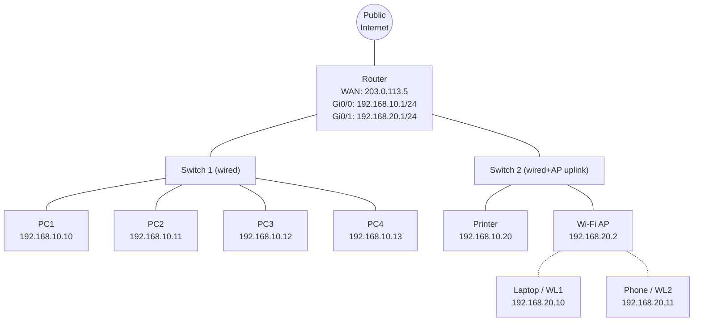

# From Frame to Forward — Network Analysis

## 0. Topology

The company floor has:
- 1 router (WAN uplink + two LAN interfaces, one per subnet)
- 2 switches on the wired side (redundancy + port density; SW1 serves PCs, SW2 serves the printer and the AP uplink)
- 4 PCs, 1 printer
- 1 Wi-Fi access point (AP) serving 2 wireless devices, uplinked to SW2 on a separate VLAN/subnet



Switches operate at Layer 2 and are transparent to IP. The router is the only device that spans the two subnets and the public link.

---

## Part 1 — MAC & Frame Handling

### 1.1 MAC address assignment

MACs are 48-bit, written as six hex bytes. To be safe against clashing with real vendor OUIs I use **locally-administered** addresses (the `x2`/`x6`/`xA`/`xE` low nibble of the first byte sets the *Locally Administered* bit).

| Device            | Interface     | MAC address           |
| ----------------- | ------------- | --------------------- |
| Router            | Gi0/0 (wired) | `02:AA:01:00:00:01`   |
| Router            | Gi0/1 (Wi-Fi) | `02:AA:01:00:00:02`   |
| Router            | WAN           | `02:AA:01:00:00:FE`   |
| Switch 1          | mgmt          | `02:AA:02:00:00:01`   |
| Switch 2          | mgmt          | `02:AA:02:00:00:02`   |
| AP                | LAN uplink    | `02:AA:03:00:00:01`   |
| PC1 … PC4         | NIC           | `02:BB:10:00:00:0A` … `0D` |
| Printer           | NIC           | `02:CC:20:00:00:01`   |
| Wireless client 1 | Wi-Fi         | `02:DD:30:00:00:01`   |
| Wireless client 2 | Wi-Fi         | `02:DD:30:00:00:02`   |

Switch ports do not have their own MAC in the data path — a switch learns and forwards on MACs it sees, but a purely-L2 switch is not itself a MAC-visible endpoint.

### 1.2 Structure of a frame sent from PC1 to the Printer

PC1 wants to talk to the printer at `192.168.10.20`. Since the printer is in the same subnet, PC1 sends an **ARP request** first (broadcast frame, `FF:FF:FF:FF:FF:FF`) asking *"who has 192.168.10.20?"*. The printer replies with its MAC (`02:CC:20:00:00:01`), which PC1 caches. Then PC1 sends the actual data frame:

```
+----------+----------------------+----------------------+-----------+---------------------------------+------+
| Preamble | Destination MAC      | Source MAC           | EtherType | Payload (IP packet)             | FCS  |
| + SFD    | 02:CC:20:00:00:01    | 02:BB:10:00:00:0A    | 0x0800    | (IP header + TCP/UDP + data)    | CRC  |
| 8 B      | 6 B                  | 6 B                  | 2 B       | 46 – 1500 B                     | 4 B  |
+----------+----------------------+----------------------+-----------+---------------------------------+------+
                              <----------------- Ethernet II frame ----------------->
```

Notes:
- Preamble + SFD (8 B) are used by the receiver to lock timing; they are not usually counted as part of the "frame proper."
- **EtherType `0x0800`** means the payload is IPv4. `0x0806` would be ARP; `0x86DD` would be IPv6.
- The **FCS** (Frame Check Sequence) is a CRC-32 computed over Dest MAC through end of payload; the receiver recomputes it and drops the frame if it does not match.
- Payload minimum of 46 bytes exists to guarantee that legacy CSMA/CD collision detection can operate; smaller payloads are padded.

Inside the payload, the **IP header** carries `src = 192.168.10.10`, `dst = 192.168.10.20`. The IP addresses do **not** change end-to-end on this LAN; the MAC addresses stay stable too because everything is inside a single broadcast domain — the two switches only *look at* the destination MAC in their CAM tables and forward accordingly.

### 1.3 Collision handling

**Wired Ethernet — CSMA/CD (Carrier Sense Multiple Access with Collision Detection)**

Historically necessary on shared coax / hubs, where two stations transmitting at the same time would create an unintelligible signal on the wire.

1. **Carrier Sense** — before transmitting, a NIC listens for existing traffic. If the medium is busy, it defers.
2. **Multiple Access** — if idle, the NIC begins transmitting.
3. **Collision Detection** — while transmitting, the NIC continues to sample the medium. A voltage anomaly indicates another station started at (nearly) the same time.
4. On detection, both stations send a **jam signal** so every listener knows a collision occurred, then each backs off for a **random** time drawn from an exponentially-widening window (`0 … 2^k − 1` slot times, k = collision count, capped at 10). The randomness prevents both from restarting simultaneously.

Modern reality: every port on a managed switch is a **separate collision domain**, and links between NIC and switch are **full-duplex** — the NIC can transmit and receive on separate wire pairs at the same time. In this topology, PC1 ↔ SW1 is full-duplex, so *no collisions can happen at all*. CSMA/CD is still a required part of the standard but almost never fires.

**Wi-Fi — CSMA/CA (Collision Avoidance)**

Radios cannot listen while they transmit (transmit power drowns the receiver), so *detecting* a collision is impossible — hence "avoidance" instead of "detection".

1. **Carrier Sense** via *physical* sensing plus a *virtual* mechanism (the NAV — Network Allocation Vector — populated from `Duration` fields on overheard frames).
2. Before sending, a station waits for the channel to be idle for one **DIFS** interval (~34 µs in 802.11n) and then a random **backoff** counted down in slot times. Backoff is only decremented while the medium is idle, so a station that started counting earlier has priority.
3. Optional **RTS/CTS** exchange: a sender asks *"may I send 1200 bytes?"*, the AP replies *"yes, for X µs, others hold off"*. This solves the **hidden-terminal problem** — two clients may be out of range of each other but both in range of the AP, so pure physical sensing is insufficient.
4. Every unicast frame gets an **ACK**; if no ACK arrives, the sender assumes a collision and retransmits with a wider backoff window.

So the two schemes differ fundamentally in **when** they act:
- Wired **detects** collisions during the send and recovers.
- Wireless **avoids** them beforehand with backoff + RTS/CTS + ACK-based retransmit, because after-the-fact detection isn't feasible.

---

## Part 2 — IP Addressing & Subnetting

### 2.1 Chosen private range

The wired and wireless portions are placed in **separate /24 subnets** so that broadcasts stay contained, ACLs on the router can enforce policy between them (e.g. "guest Wi-Fi cannot print"), and the two failure domains are independent.

| Segment      | Subnet             | Usable host range          | Broadcast        | Gateway         |
| ------------ | ------------------ | -------------------------- | ---------------- | --------------- |
| Wired LAN    | `192.168.10.0/24`  | `192.168.10.1 – .254`      | `192.168.10.255` | `192.168.10.1`  |
| Wireless LAN | `192.168.20.0/24`  | `192.168.20.1 – .254`      | `192.168.20.255` | `192.168.20.1`  |
| Router WAN   | `203.0.113.4/30`   | (assigned by ISP)          | `203.0.113.7`    | ISP-side        |

Two /24s were used (rather than splitting one /24 into two /25s) for readability — 254 addresses per side leaves plenty of headroom. If tight on the address plan, splitting `192.168.10.0/24` into `192.168.10.0/25` (wired, 126 usable) and `192.168.10.128/25` (wireless, 126 usable) would work identically at the routing layer.

### 2.2 Full address plan

| Device              | Subnet             | IP address      | Default gateway  | Assignment |
| ------------------- | ------------------ | --------------- | ---------------- | ---------- |
| Router — Gi0/0      | `192.168.10.0/24`  | 192.168.10.1    | —                | Static     |
| Router — Gi0/1      | `192.168.20.0/24`  | 192.168.20.1    | —                | Static     |
| Router — WAN        | `203.0.113.4/30`   | 203.0.113.5     | 203.0.113.6      | ISP        |
| Switch 1 (mgmt)     | `192.168.10.0/24`  | 192.168.10.2    | 192.168.10.1     | Static     |
| Switch 2 (mgmt)     | `192.168.10.0/24`  | 192.168.10.3    | 192.168.10.1     | Static     |
| Printer             | `192.168.10.0/24`  | 192.168.10.20   | 192.168.10.1     | Static (DHCP reservation) |
| PC1 – PC4           | `192.168.10.0/24`  | 192.168.10.10 – .13 | 192.168.10.1 | DHCP       |
| AP (mgmt)           | `192.168.20.0/24`  | 192.168.20.2    | 192.168.20.1     | Static     |
| Wireless client 1   | `192.168.20.0/24`  | 192.168.20.10   | 192.168.20.1     | DHCP       |
| Wireless client 2   | `192.168.20.0/24`  | 192.168.20.11   | 192.168.20.1     | DHCP       |

The **default gateway** on every host is the router's interface *on that host's subnet*. That is the only L3 device that can leave the subnet — everything a host cannot reach on its own broadcast domain gets forwarded to the gateway.

Printer gets a **DHCP reservation** (or static) so PCs can always find it at the same IP; user-facing endpoints (PCs, laptops, phones) are DHCP-leased for zero-touch onboarding.

### 2.3 Role of DHCP

DHCP (Dynamic Host Configuration Protocol) removes the operational cost of manually assigning IPs on user endpoints. The router runs a DHCP server on each LAN interface. A new client goes through the **DORA** exchange:

1. **DHCPDISCOVER** — client boots without an IP, broadcasts (`0.0.0.0 → 255.255.255.255`) asking any DHCP server on the segment to speak up.
2. **DHCPOFFER** — server proposes a lease with a candidate IP, subnet mask, gateway, DNS, and lease duration.
3. **DHCPREQUEST** — client (still broadcasting, in case there were multiple offers) says which offer it accepts.
4. **DHCPACK** — server confirms; the client now owns the address for the lease duration and will `RENEW` before expiry.

The DHCP server also hands out:
- **Subnet mask** — so the client knows which destinations are "local" (no gateway needed).
- **Default gateway** — the router's IP on the client's subnet.
- **DNS servers** — for name resolution.
- Optionally NTP, WPAD, boot server, TFTP path, etc.

Without DHCP, every one of the ten client devices in this floor would need a manual IP + subnet + gateway + DNS config, and moving a device (or adding a phone to the Wi-Fi) would be a ticket instead of a plug-in.

---

## Part 3 — Routing & Packet Forwarding

### 3.1 Scenario — WL1 opens `https://example.com`

WL1 (`192.168.20.10`, MAC `02:DD:30:00:00:01`) resolves `example.com` to `93.184.216.34` via the DNS server pushed by DHCP (say `1.1.1.1`, itself reached through the same forwarding path). It then opens a TCP connection to `93.184.216.34:443`. We follow the very first outbound packet — the TCP `SYN`.

### 3.2 Step-by-step

1. **WL1 decides "not local"**. WL1 masks the destination `93.184.216.34` with its own mask `/24`. `93.184.216.0` ≠ `192.168.20.0`, so the destination is *not* on the local subnet. WL1 must forward the packet to its **default gateway** `192.168.20.1`.

2. **ARP for the gateway's MAC.** WL1 checks its ARP cache for `192.168.20.1`. If missing, it broadcasts an ARP request over Wi-Fi; the router replies with `02:AA:01:00:00:02`.

3. **WL1 builds the frame.**
   - L2: `dst = 02:AA:01:00:00:02` (router), `src = 02:DD:30:00:00:01` (WL1)
   - L3: `src = 192.168.20.10`, `dst = 93.184.216.34`, TTL = 64
   - L4: `src port = 51314` (ephemeral), `dst port = 443`, TCP SYN
   - Encrypts / encapsulates over the Wi-Fi link and sends to the AP.

4. **AP bridges the frame** onto Ethernet toward SW2, which forwards it to the router's `Gi0/1` port (based on the router's MAC in the frame).

5. **Router receives the frame** on `Gi0/1`. It:
   - **Strips the L2 header** — the MACs used to get across the LAN are irrelevant beyond this hop.
   - **Reads the IP header.** Fields the router uses:
     - `Destination IP` — for the **routing decision** (see below).
     - `TTL` — decremented by 1; if it hits 0 the router drops the packet and returns ICMP "Time Exceeded".
     - `Header Checksum` — must be verified on ingress, then **recomputed on egress** because TTL changed.
     - `Source IP`, `Protocol`, `Total Length`, `DSCP` — informative / policy.
   - **Consults its routing table.** A typical table on this router looks like:

     | Destination        | Next hop / interface  | Preference |
     | ------------------ | --------------------- | :--------: |
     | 192.168.10.0/24    | Gi0/0 (directly conn.)| C          |
     | 192.168.20.0/24    | Gi0/1 (directly conn.)| C          |
     | 203.0.113.4/30     | WAN (directly conn.)  | C          |
     | 0.0.0.0/0          | 203.0.113.6 via WAN   | S/DHCP     |

     Match is by **longest prefix**. `93.184.216.34` does not match any specific route, so the **default route** wins: next hop `203.0.113.6` (the ISP's router), egress interface `WAN`.

6. **NAT / PAT rewrite at egress.** The internal source `192.168.20.10:51314` is not routable on the public Internet. The router applies **PAT** (Port-Address Translation, a form of NAT) and rewrites the packet:

   | Field         | Before                       | After                                |
   | ------------- | ---------------------------- | ------------------------------------ |
   | Source IP     | 192.168.20.10                | **203.0.113.5** (router's WAN IP)    |
   | Source port   | 51314                        | **62001** (allocated by the NAT)     |
   | Destination   | 93.184.216.34 : 443          | (unchanged)                          |

   It records the mapping in its **NAT translation table**:

   ```
   Inside  192.168.20.10 : 51314   ⇄   Outside  203.0.113.5 : 62001   →   93.184.216.34 : 443
   ```

7. **Router builds a new L2 frame** on the WAN link — with source MAC = router's WAN MAC and destination MAC = ISP-side router's MAC (learned via ARP on the WAN broadcast domain) — and transmits.

8. **Onward across the Internet.** Each transit router repeats step 5 in its own routing table (decrement TTL, recompute checksum, choose next hop by longest-prefix match). The IP header's src/dst pair stays the rewritten `203.0.113.5 : 62001 → 93.184.216.34 : 443` all the way; only the L2 headers get replaced hop by hop.

9. **Return path.** The web server replies to `203.0.113.5 : 62001`. The packet reaches our router on its WAN interface. The router consults the NAT table, finds the mapping, and **reverses** the rewrite: `203.0.113.5 : 62001 → 192.168.20.10 : 51314`. It then routes on the internal side: `192.168.20.10` matches `192.168.20.0/24` (directly connected), ARP-resolves `192.168.20.10`, builds a new L2 frame with the correct wireless MAC, and forwards to the AP, which delivers it to WL1.

### 3.3 Summary of the three concepts

**How the IP header is used at each hop**
- **Destination IP** → picks the outbound interface via longest-prefix match against the routing table.
- **TTL** → decremented; guarantees packets can't loop forever.
- **Checksum** → verified in, recomputed out.
- **Source IP** → normally unchanged in transit — *except* when NAT is in play (see below).
- **Fragmentation fields (Identification, Flags, Fragment Offset)** → let the router split a packet if the next link's MTU is smaller.

**How the router decides the next hop**
- Match `dst IP` against every entry in the routing table.
- **Longest prefix wins** (`192.168.10.0/24` beats `192.168.0.0/16` beats `0.0.0.0/0`).
- Directly-connected routes always take priority for their subnet.
- Anything unmatched falls to the **default route** `0.0.0.0/0`, which points at the ISP.

**Role of NAT on the router**
- Private RFC-1918 addresses (`192.168.0.0/16`, `10.0.0.0/8`, `172.16.0.0/12`) are not globally routable — carriers drop them.
- The router acts as a **single public identity** for all internal hosts by rewriting outbound source IP/port to its own WAN IP + an allocated port.
- The mapping (`inside_ip:inside_port` ⇄ `wan_ip:wan_port`) is stored in the NAT table so return traffic can be delivered back to the correct internal host.
- This gives us three things at once: **address conservation** (one public IP shared by many), **implicit inbound firewalling** (no NAT entry ⇒ no way in), and **freedom to renumber internally** without touching the public world.

The trade-off is that **inbound-initiated** connections to a host behind NAT require explicit port-forwarding or a rendezvous service (STUN/TURN/UPnP), because the router has no way to know *which* internal host should receive an unsolicited public-side packet.
