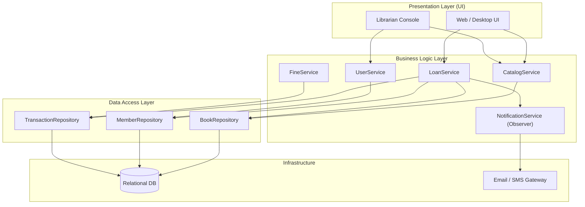
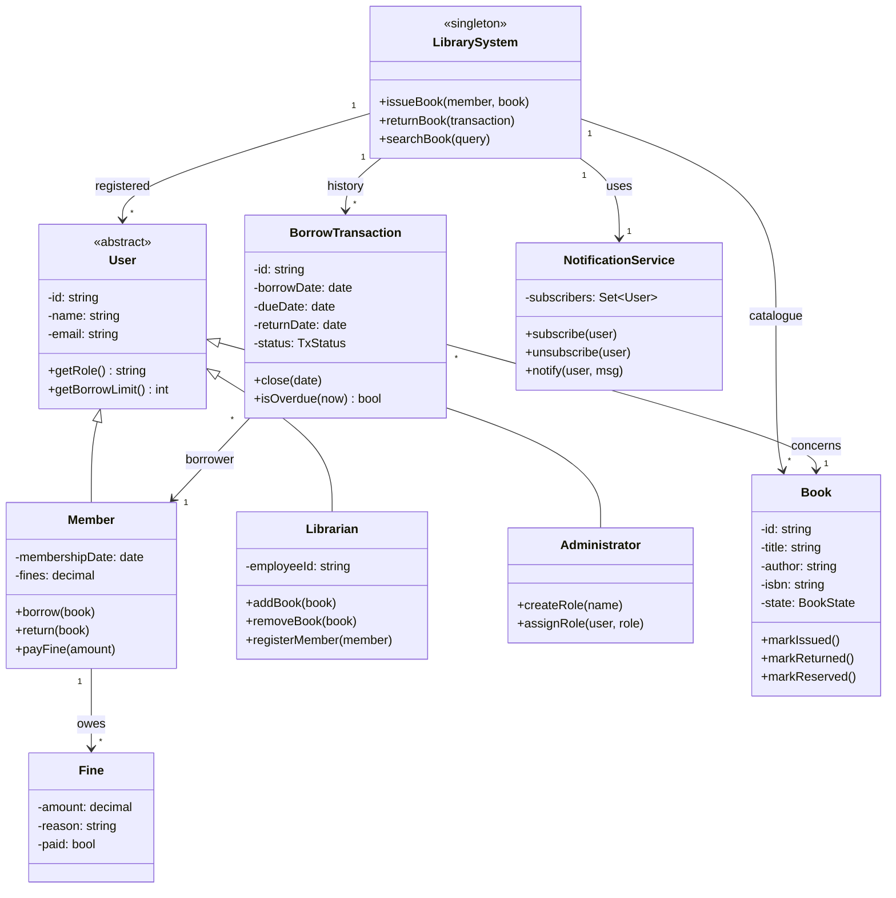
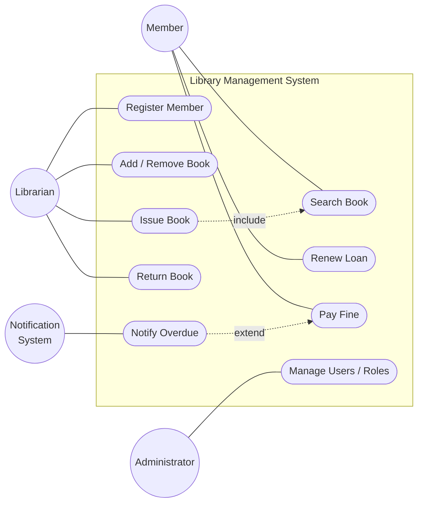
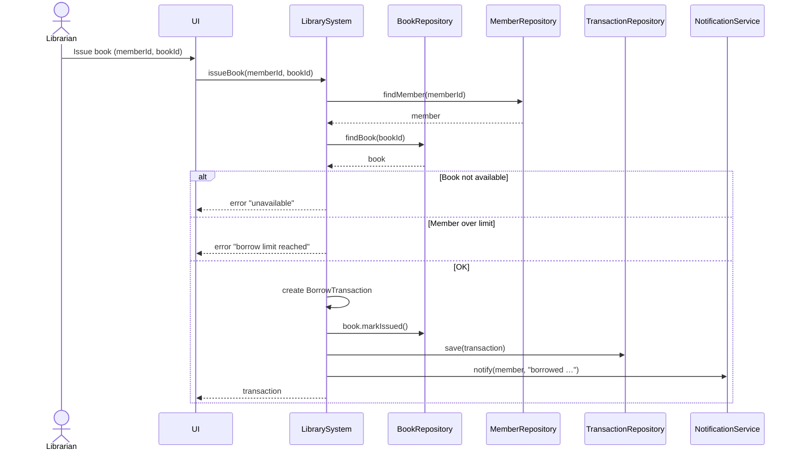
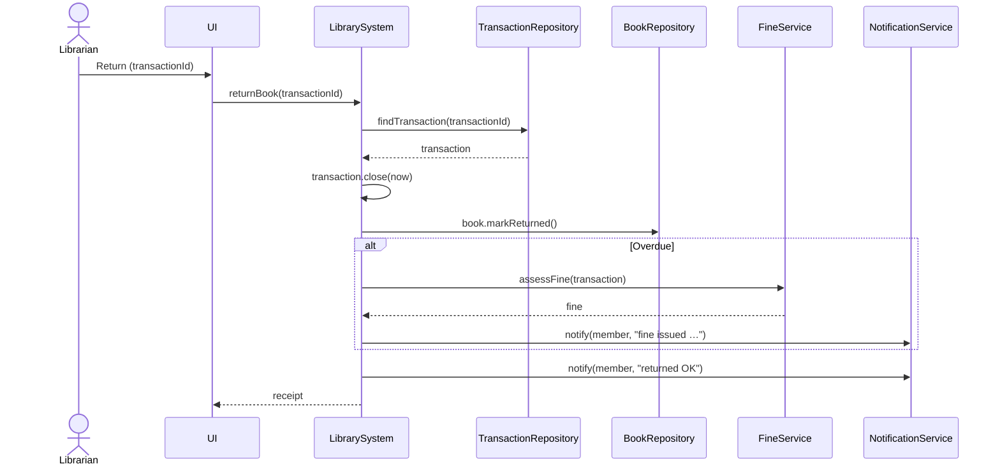
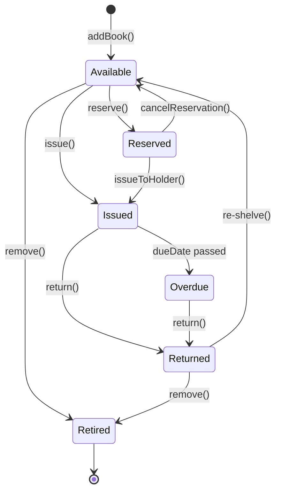
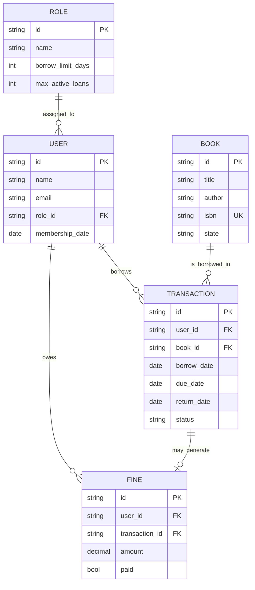

# Library Management System — Object-Oriented Analysis & Architectural Modeling

Checkpoint focused on **analysis and modeling**, not implementation. Diagrams are written in [Mermaid](https://mermaid.js.org/) so they render directly on GitHub, in VS Code (with the Markdown Preview Mermaid extension), or on any Mermaid-compatible viewer.

A concrete implementation of a very similar domain lives in a sibling folder (`SmartLibraryManagementSystem/`) — this document is the OOA that would have preceded it.

---

## 1. Requirement Analysis

### 1.1 Actors

| Actor         | Description                                                                 |
| ------------- | --------------------------------------------------------------------------- |
| **Member**    | End user (student, teacher…) who searches, borrows and returns books.       |
| **Librarian** | Staff who catalogues books, registers members, oversees borrow/return.     |
| **Administrator** | Manages users, roles and system-wide configuration (fine rules, limits). |
| **Notification System** *(secondary)* | External component sending overdue reminders (email/SMS).       |

### 1.2 Key use cases

| # | Use case              | Primary actor | Trigger                                    |
| - | --------------------- | ------------- | ------------------------------------------ |
| UC1 | Search Book          | Member        | Member wants a book                        |
| UC2 | Register Member      | Librarian     | New member joins the library               |
| UC3 | Add / Remove Book    | Librarian     | Catalogue update                           |
| UC4 | Issue Book           | Librarian     | Member requests to borrow                  |
| UC5 | Return Book          | Librarian     | Member returns a borrowed copy             |
| UC6 | Renew Loan           | Member        | Member wants more time on an active loan   |
| UC7 | Notify Overdue       | System        | Scheduled scan detects overdue transaction |
| UC8 | Pay Fine             | Member        | Member has an outstanding fine             |
| UC9 | Manage Users / Roles | Administrator | Onboarding / offboarding                   |

### 1.3 Non-functional requirements (excerpt)

- **Availability** — the catalogue must be reachable during opening hours.
- **Data integrity** — a book cannot be borrowed by two members simultaneously.
- **Traceability** — every transaction is auditable.
- **Extensibility** — new user categories (visitor, researcher…) should be pluggable.

---

## 2. System Architecture

Three-tier layered architecture with an external notification component.



**Layer responsibilities**

- **UI** — user interaction only, no rules.
- **Business Logic** — enforces borrowing rules, orchestrates transactions, publishes events.
- **Data Access** — persists and queries aggregates (Books, Members, Transactions).
- **Infrastructure** — external I/O (database, mail gateway).

---

## 3. Object-Oriented Analysis

### 3.1 Class Diagram



### 3.2 Use Case Diagram



### 3.3 Sequence Diagrams

#### 3.3.1 Issue Book (UC4)



#### 3.3.2 Return Book (UC5)



### 3.4 State Diagram — Book



---

## 4. Data, Functional and Behavioral Models

### 4.1 Data model (logical, relational-flavoured)



### 4.2 Functional model — what the system *does*

Top-level operations grouped by service. Each is a pure function of its inputs plus the current state of its aggregates.

| Service              | Operation                              | Input                                | Output / effect                          |
| -------------------- | -------------------------------------- | ------------------------------------ | ---------------------------------------- |
| CatalogService       | `searchBooks(query)`                   | keyword, filters                     | list of matching books                   |
|                      | `addBook(book)`                        | book DTO                             | catalogue updated                        |
|                      | `removeBook(bookId)`                   | id                                   | book set to *Retired*                    |
| UserService          | `registerMember(profile)`              | name, email, role                    | new Member persisted                     |
|                      | `assignRole(userId, roleId)`           | ids                                  | user role updated                        |
| LoanService          | `issueBook(memberId, bookId)`          | ids                                  | BorrowTransaction + Book *Issued*        |
|                      | `returnBook(txId)`                     | id                                   | tx closed, Book *Returned*, fine if late |
|                      | `renewLoan(txId)`                      | id                                   | due date extended                        |
| FineService          | `assessFine(tx)`                       | overdue tx                           | Fine created                             |
|                      | `payFine(fineId, amount)`              | id, amount                           | Fine settled                             |
| NotificationService  | `notify(user, message)`                | recipient, message                   | message pushed if subscribed             |
|                      | `broadcast(message)`                   | message                              | delivered to all subscribers             |

### 4.3 Behavioral model — how the system *reacts over time*

Book life-cycle is captured in section **3.4**. Two other behavioral facets:

- **Transaction status machine** — `Active → Returned` (normal) or `Active → Overdue → Returned` (late). `Overdue` is reached when a scheduled `checkOverdue()` scan detects `now > dueDate`. Entering `Overdue` triggers `NotificationService.notify(...)` once.
- **Member fine state** — a Member is *In Good Standing* when `sum(unpaid fines) == 0`, otherwise *Suspended* (cannot borrow). Payment transitions back.

---

## 5. From Abstraction to Implementation

Pseudocode kept minimal — the goal is to show that the analysis lands cleanly in code. A working implementation of a very close domain lives in `../SmartLibraryManagementSystem/src/`.

### 5.1 `Book` class

```pseudo
class Book:
    id: string
    title: string
    author: string
    isbn: string
    state: BookState = AVAILABLE

    method markIssued():
        require state == AVAILABLE or state == RESERVED
        state = ISSUED

    method markReturned():
        require state == ISSUED or state == OVERDUE
        state = RETURNED

    method reshelve():
        require state == RETURNED
        state = AVAILABLE
```

### 5.2 `BorrowTransaction`

```pseudo
class BorrowTransaction:
    id: string
    member: Member
    book: Book
    borrowDate: date
    dueDate: date        // = borrowDate + member.role.borrowLimitDays
    returnDate: date?
    status: {ACTIVE, OVERDUE, RETURNED}

    method isOverdue(now):
        return status != RETURNED and now > dueDate

    method close(returnDate):
        this.returnDate = returnDate
        this.status = RETURNED
```

### 5.3 `LibrarySystem` (Singleton orchestrator)

```pseudo
class LibrarySystem singleton:
    books: Repository<Book>
    members: Repository<Member>
    transactions: Repository<BorrowTransaction>
    notifier: NotificationService

    method issueBook(memberId, bookId):
        member  = members.find(memberId)
        book    = books.find(bookId)
        guard  book.state == AVAILABLE   else error "not available"
        guard  member.activeLoans() < member.role.maxActiveLoans else error "over limit"
        guard  member.status == IN_GOOD_STANDING else error "suspended"

        tx = new BorrowTransaction(member, book, today)
        book.markIssued()
        transactions.save(tx)
        notifier.notify(member, "You borrowed " + book.title + ", due " + tx.dueDate)
        return tx

    method returnBook(txId):
        tx = transactions.find(txId)
        tx.close(today)
        tx.book.markReturned()
        if tx.borrowDate + tx.member.role.borrowLimitDays < today:
            fine = fineService.assessFine(tx)
            notifier.notify(tx.member, "Late — fine of " + fine.amount)
        notifier.notify(tx.member, "Returned OK")
        return receipt(tx)
```

### 5.4 Traceability — analysis → code

| Analysis artefact              | Code counterpart in `SmartLibraryManagementSystem/` |
| ------------------------------ | --------------------------------------------------- |
| `User` abstract class          | `src/User.js`                                       |
| `Member` (analog: Student/Teacher) | `src/Student.js`, `src/Teacher.js`             |
| `Book` state machine           | `src/Book.js` (availability flag — simplified)      |
| `BorrowTransaction`            | `src/BorrowTransaction.js`                          |
| `LibrarySystem` singleton      | `src/LibrarySystem.js`                              |
| `NotificationService` observer | `src/NotificationService.js`                        |
| `UserFactory` (creation)       | `src/UserFactory.js`                                |

---

## 6. Design decisions & trade-offs

- **Layered architecture** was chosen over a single-file script because the analysis surfaces distinct responsibilities (catalogue vs loans vs notifications) — grouping them into layers keeps each service testable in isolation.
- **`User` as abstract class** rather than an interface — the shared identity fields (`id`, `name`, `email`) belong at the base; only the *policy* (`borrowLimit`, `role`) varies.
- **`BorrowTransaction` as a first-class entity** rather than a field on `Book` — a book has a history of many transactions, and fine assessment needs the temporal record.
- **Singleton `LibrarySystem`** — appropriate because there is exactly one library context per running instance; the trade-off is that global state complicates parallel tests, so the code exposes a `_resetForTests` hook.
- **Observer for notifications** — decouples "something happened" from "who cares." Currently only users subscribe, but an audit logger or an email gateway could plug in without touching `LoanService`.

---

## 7. Deliverables checklist

- [x] Actors identified (§1.1)
- [x] Use cases listed (§1.2)
- [x] Component architecture diagram (§2)
- [x] Class diagram (§3.1)
- [x] Use case diagram (§3.2)
- [x] Sequence diagrams for two use cases (§3.3)
- [x] State diagram for `Book` (§3.4)
- [x] Data model (§4.1)
- [x] Functional model (§4.2)
- [x] Behavioral model (§4.3)
- [x] Pseudocode / code snippets (§5)
