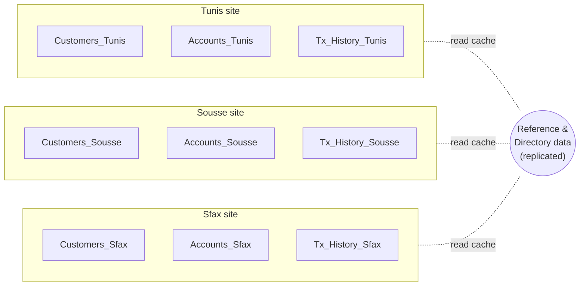

# Mini Banking System — Analysis

---

## Part 1 — Transaction Management (Conceptual)

**Setup.** Users can transfer money between accounts and view balances. Two users initiate transfers **at the same time** that touch the **same account**.

### 1.1 Concurrency issue — **lost update**

The classic hazard when two transactions perform a **read → modify → write** cycle on the same row without coordination:

- `T1` reads account `A`'s balance.
- `T2` reads account `A`'s balance (before `T1` writes).
- Both compute the *new* balance based on the same original value.
- Both write. The **later write silently overwrites the earlier one** — one debit or credit vanishes from the ledger.

Other hazards that could show up on this workload but are secondary here:

- **Dirty read** — a viewer reads a balance that a partially-committed transfer has already debited but not yet credited.
- **Non-repeatable read** — an audit query reads a balance twice and sees two different values.
- **Write skew** — two transactions each check an invariant (e.g. "balance ≥ 0") independently, and their combined writes break the invariant.

The tasks below focus on the lost-update case because it is the failure mode two concurrent transfers on the same account produce first.

### 1.2 Locking mechanism

**Row-level exclusive (X) locks under two-phase locking (2PL)**, held from the first read of an involved account until commit.

Concretely, per transfer:

1. **Acquire an X-lock on both accounts involved.**
   Acquire in a **canonical order** (e.g. by numeric account id, ascending) — this is the standard trick to prevent deadlock between two transfers that touch the same pair in opposite order.
2. Read balances, verify the debit account has sufficient funds.
3. Write the new balances.
4. `COMMIT` — locks are released.

Notes on the choice:

- **Exclusive**, not shared: both transactions want to write, so a shared (S) lock is not enough — two S-locks would coexist and let the race back in.
- **Row-level**, not table-level: two transfers between disjoint account pairs must be able to run in parallel; locking the whole table would kill throughput.
- **Two-phase**: locks are acquired in a growing phase (before any release) and released in a shrinking phase (only at commit here — a variant called **strict 2PL**, which also prevents cascading rollbacks).

**On viewing balances.** A read-only "view my balance" can hold a **shared (S) lock**, which is compatible with other S-locks but blocked by a writer's X-lock. This lets many viewers read concurrently while a transfer is in flight blocks all of them until commit — no dirty reads.

### 1.3 Pessimistic vs. optimistic — **pessimistic**

Optimistic concurrency control works by **not locking** — every transaction proceeds hopefully, then at commit time the system checks whether any row it read has been modified in the meantime; if so, the transaction is **aborted and retried**.

Optimistic wins when **conflicts are rare** (a mostly-read workload, or writes touching disjoint rows). It costs almost nothing when reality matches the optimism.

Banking transfers on hot accounts (salary accounts, corporate accounts, joint accounts) violate that assumption:

- The **same account rows are contended by many concurrent transactions**.
- The **retry cost is high**: a failed transfer forces a full restart, potentially bothering the user or firing partial notifications; regulators do not love non-determinism.
- **Deadlock is rarer than retry storm** — repeated aborts on contended rows can starve some transactions.

**Choose pessimistic locking.** Take the write lock up front, block competitors briefly, get a deterministic outcome. The blocking cost is small compared to a rollback + user-visible retry cycle.

### 1.4 Schedule tables

**Scenario.** Account `A` starts at **500 TND**. Two transfers happen simultaneously:

- `T1` — transfer **100** from `A` → `B`.
- `T2` — transfer **50** from `A` → `C`.

The correct final balance for `A` is **500 − 100 − 50 = 350**.

#### Without locking — interleaved read/write causes a lost update

| Time | `T1` (A → B, −100)         | `T2` (A → C, −50)          | Balance of `A` | Notes |
| :--: | -------------------------- | -------------------------- | :------------: | ----- |
| t1   | Read A → 500               |                            | 500            |       |
| t2   |                            | Read A → 500               | 500            |       |
| t3   | Compute 500 − 100 = 400    |                            | 500            |       |
| t4   |                            | Compute 500 − 50 = 450     | 500            |       |
| t5   | Write A ← 400              |                            | **400**        |       |
| t6   |                            | Write A ← 450              | **450** ❌     | `T1`'s update lost — should be 350. |

**Unsafe.** The final balance is 450 instead of 350; 100 TND has silently vanished from the ledger. This schedule is **not serializable**.

#### With row-level X-lock under strict 2PL — safe

| Time | `T1` (A → B, −100)                  | `T2` (A → C, −50)                          | Balance of `A` |
| :--: | ----------------------------------- | ------------------------------------------- | :------------: |
| t1   | `LOCK X on A` (granted)             |                                             | 500            |
| t2   | Read A → 500                        | `LOCK X on A` requested — **wait**          | 500            |
| t3   | Compute 500 − 100 = 400             | (blocked)                                   | 500            |
| t4   | Write A ← 400                       | (blocked)                                   | 400            |
| t5   | `COMMIT` — release X-lock           | (blocked)                                   | 400            |
| t6   |                                     | `LOCK X on A` (now granted)                 | 400            |
| t7   |                                     | Read A → 400                                | 400            |
| t8   |                                     | Compute 400 − 50 = 350                      | 400            |
| t9   |                                     | Write A ← 350                               | **350** ✅     |
| t10  |                                     | `COMMIT` — release X-lock                   | 350            |

**Safe.** The schedule is **serializable** — it is equivalent to running `T1` then `T2` sequentially. No lost update.

*(For clarity the credits into `B` and `C` are omitted; the same locking rules apply to them, and acquiring locks on `A`, `B`, and `C` in ascending id order avoids deadlock if `T1` and `T2` happen to overlap on multiple accounts.)*

---

## Part 2 — Distributed Database Planning (High-Level)

**Setup.** Three branches: **Tunis**, **Sousse**, **Sfax**. Design how the data is fragmented, allocated, and replicated across the three sites.



### 2.1 Horizontal fragmentation of `Customers` by branch

Split the `Customers` table into three fragments, one per branch, using the `branch` column as the fragmentation predicate:

| Fragment          | Predicate                     | Home site |
| ----------------- | ----------------------------- | --------- |
| `Customers_Tunis` | `branch = 'Tunis'`            | Tunis     |
| `Customers_Sousse`| `branch = 'Sousse'`           | Sousse    |
| `Customers_Sfax`  | `branch = 'Sfax'`             | Sfax      |

Reconstruction rule:

```
Customers = Customers_Tunis  ∪  Customers_Sousse  ∪  Customers_Sfax
```

Why this is a good split:

- **Locality of access.** The vast majority of a customer's activity happens at their home branch, so their row lives on the site that reads it the most.
- **Complete and disjoint.** Every customer belongs to exactly one branch, so the three fragments cover the whole table with no overlap (classic requirement of a horizontal fragmentation).
- **Regulatory fit.** Financial regulators often require customer data to reside physically within a specific jurisdiction; branch-based fragmentation aligns with that.

### 2.2 Vertical separation candidate — login credentials

Split off a `CustomerCredentials` table containing only the security-sensitive columns:

| `Customers` (residual)               | `CustomerCredentials` (vertical split)     |
| ------------------------------------ | ------------------------------------------ |
| `id` (PK)                            | `customer_id` (FK → Customers.id)          |
| `name`, `birthdate`                  | `email`                                    |
| `address`, `phone`                   | `password_hash`                            |
| `branch`                             | `mfa_secret`                               |
| `national_id`                        | `last_login_at`, `failed_attempts`         |

Reasons this split pays off:

- **Least-privilege access.** The banking app itself never needs the password hash — only the auth service does. Separating credentials lets you grant *no* SELECT access on that column to the transactional workload.
- **Different backup / audit cadences.** Credentials change rarely and warrant heavier auditing; the profile table changes more often.
- **Different physical placement.** The credentials table can be stored on a more locked-down instance (KMS-encrypted disk, restricted VPC) without dragging the entire customer profile there.

Vertical fragmentation, unlike horizontal fragmentation, keeps every row on every site — what changes is *which columns* live where. Reconstruction is a join on `customer_id`.

### 2.3 What to replicate across all branches, and why

| Data                         | Replication strategy                                          | Rationale |
| ---------------------------- | ------------------------------------------------------------- | --------- |
| **Reference / directory data**  (branch list, product catalogue, currency table, interest rates, exchange rates) | **Full replication** at every site, read-only at slaves | Small, essentially read-only, and every transaction touches it. Zero locality benefit to keeping it central; huge latency benefit to keeping a local copy. |
| **Customer info** (name, contact, branch, KYC status) | **Fully replicated in a lookup form** (name + id + home branch), authoritative copy at the home site | Users may walk into any branch; the teller needs to identify them fast. But writes still go to the home site to avoid split-brain on profile edits. |
| **Account balances**         | Authoritative at the customer's home branch; **short-TTL read cache at other branches** for balance display | Balances are the hottest write path — full replication would multiply the write load and force expensive consensus. Keep them where they are written. Cross-branch balance queries are rare and can tolerate a few seconds of staleness. |
| **Transaction history**      | **Not replicated** — kept only at the home branch            | Grows unboundedly, is heavy, and is almost never queried from outside the home branch. Regulatory audit trails legally belong at the home site. See §2.4. |

Rule of thumb applied: **replicate what is small, read-heavy, and needed everywhere; keep authoritatively local what is large, write-heavy, or jurisdictional**.

### 2.4 Static vs dynamic allocation for transaction history

**Static allocation.** Every customer's transaction history stays on their home branch, permanently. Cross-branch transfers write a lightweight ledger entry at each involved site but the primary record lives with the payer's home branch.

Justification:

- **Access pattern is predictable.** 99 % of transaction-history queries come from the home branch (the customer's own statements, the branch manager's reports, regulator audits). Static allocation matches the access pattern exactly.
- **Regulatory footprint.** Financial-audit and data-retention rules bind transactions to a legal home jurisdiction. Migrating them across sites for performance would create audit gaps.
- **Cost of migration outweighs the benefit.** Dynamic allocation would need mechanisms to move partitions on hot/cold detection, rewrite indexes, and keep referential integrity across sites in flight — expensive machinery for a data set that is (a) mostly cold historic data and (b) already located where most queries come from.
- **Dynamic allocation would earn its keep** if customers frequently changed their home branch or if the traffic pattern drifted week-to-week. In this bank, neither happens: home branch is set at onboarding and roughly permanent.

**Conclusion:** static allocation for transaction history, dynamic caching (short-lived, invalidatable) for balance snapshots when other branches need them.
